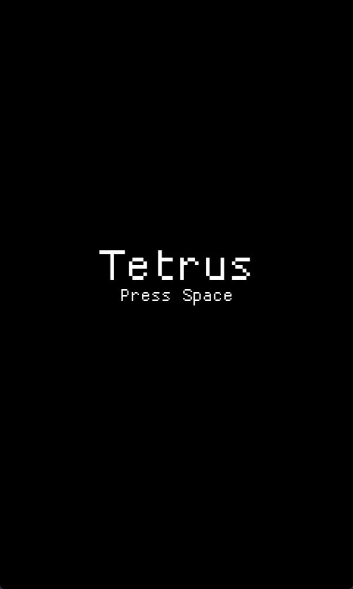

# Tetrus: Minimal Tetris build with Rust



### Usage
`cargo run --release`

### Controls
```
A => shift left
D => shift right
S => increase movement speed
W => rotate tetromino
Space => drop tetromino

Esc => Exit
```